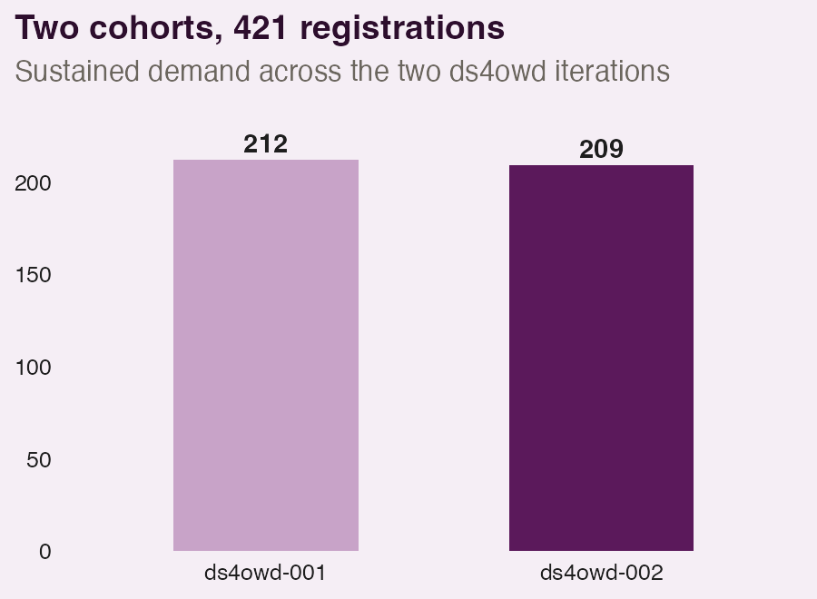
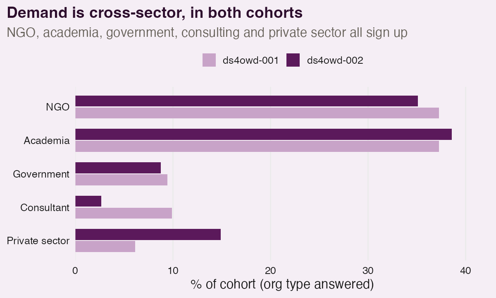
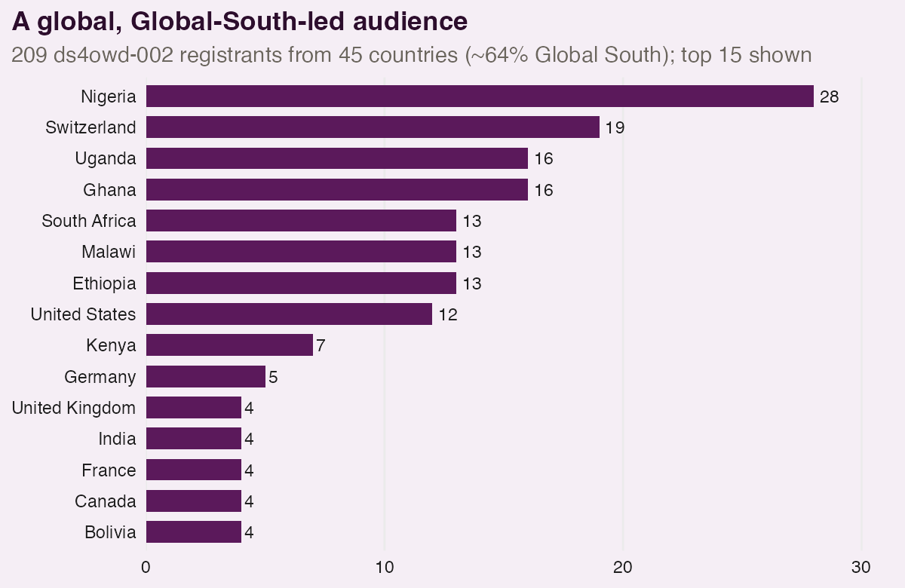
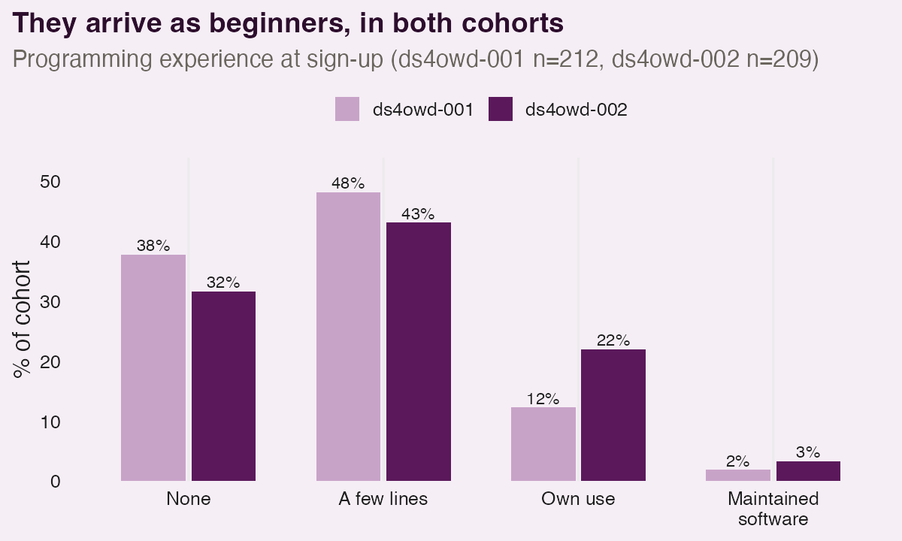
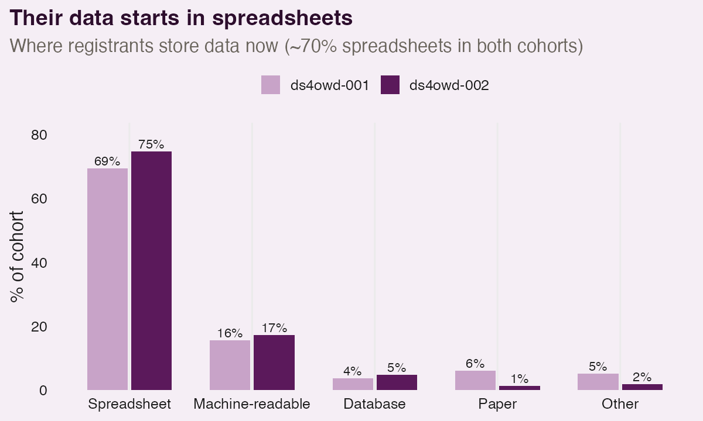
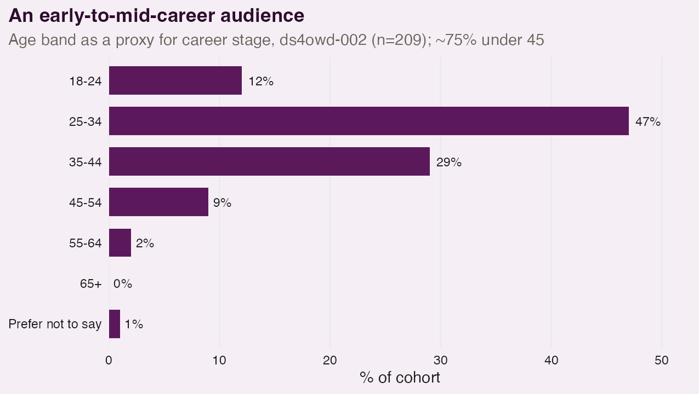
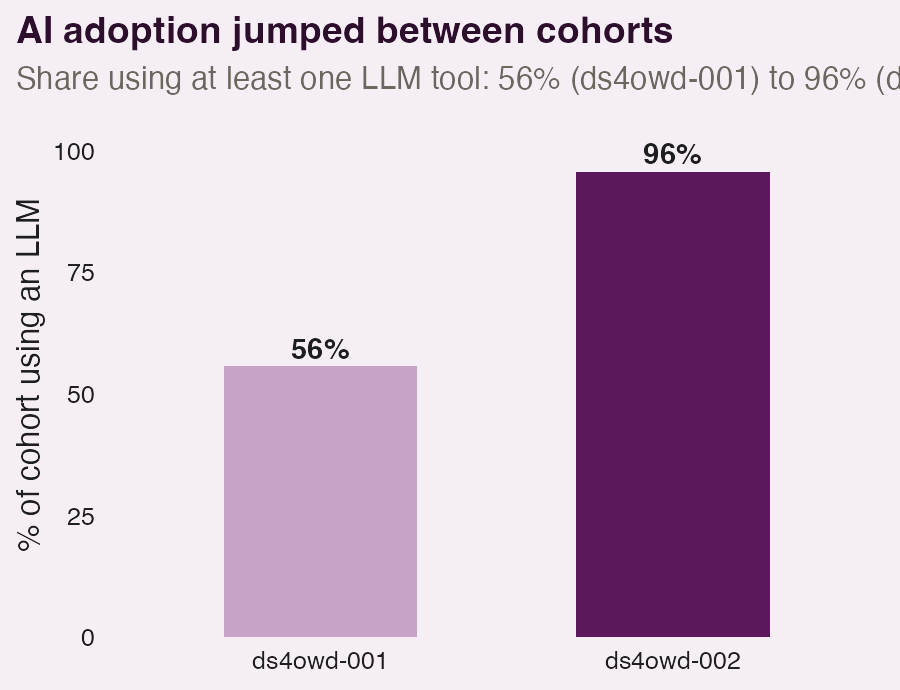
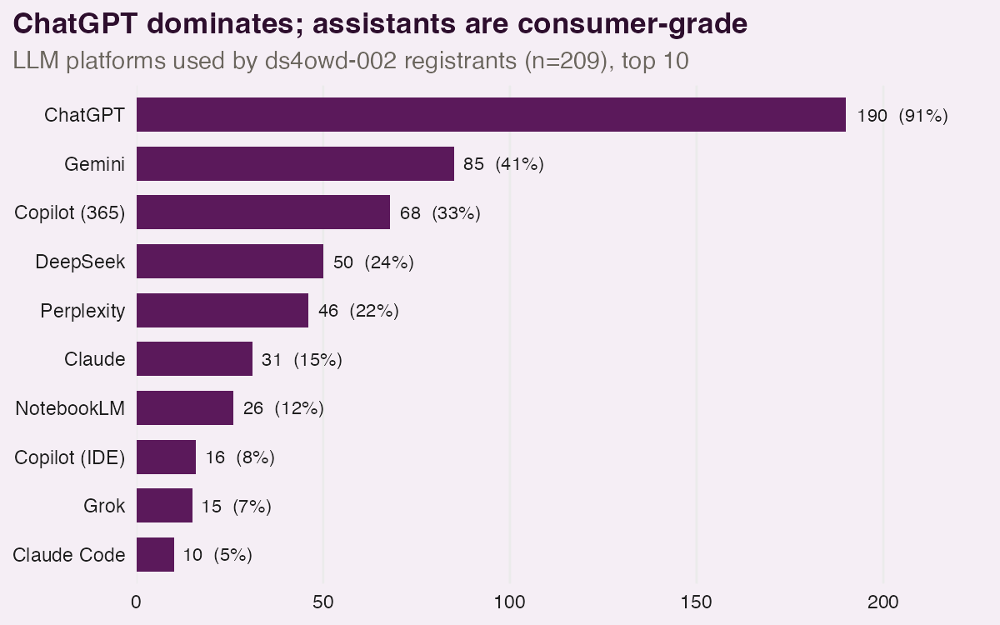
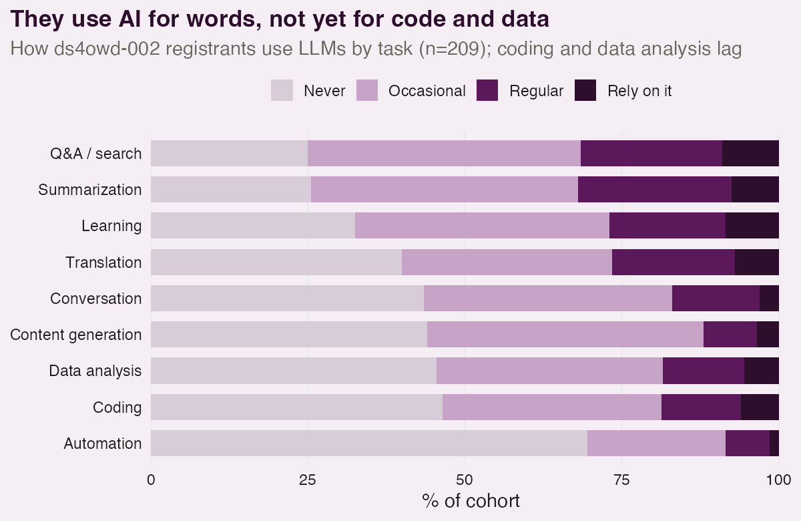

The demand for practical, open, reproducible WASH data skills is measured. The free Data Science for openwashdata course has run twice, drawing **421 registrations across the two cohorts (ds4owd-001 and ds4owd-002)**. The figures below come from the pre-course surveys those participants completed at sign-up. They describe the audience the 2027 retreat would serve, and the pre-course survey that produced them is the same instrument that would screen and baseline workshop applicants.

# Sustained, cross-sector demand

Two cohorts, 421 people, and a mix of organisations that mirrors the community AGUASAN convenes: NGOs, academia, government, consultancies, and the private sector.

They come from **45 countries, with a strong Global-South majority** (Nigeria, Uganda, Ghana, Ethiopia, Malawi, and South Africa lead the list). This is the reach the workshop's diversity goals depend on.

# They arrive as beginners

The people who sign up are early-to-mid career and, by their own account, not yet coders. 

Around three-quarters have written little or no code, roughly 70 percent keep their data in spreadsheets, and about three-quarters are under 45. Their data is unpublished not from unwillingness but because the skills and habits are missing. That gap is what the week closes.

# They use AI, but not yet for their data

The audience is adopting AI fast, but for words, not for the code-and-data work the sector needs. This is the sharpest argument for the retreat: it meets people where they already are and points their AI use at their own datasets.

Use of at least one LLM tool rose from 56 percent in the first cohort to 96 percent in the second. But that use is consumer-grade (ChatGPT dominates) and aimed at summarising and translating, not at coding or data analysis, where the "never" share is highest. The retreat turns broad, shallow AI familiarity into safe, practical use on the participant's own data.

# A note on the data

These are registration-time self-reports. The sector, skill, and data-format figures cover both cohorts; geography, career stage, and the AI detail come from the second cohort only, because the two surveys asked slightly different questions. Career stage is shown as an age proxy: the survey has no direct seniority or leadership field yet, a gap flagged for the next survey revision. Every figure is labelled with its cohort and sample size, and all are reproducible from the de-identified survey extracts via `demand/make-figures.R`.
